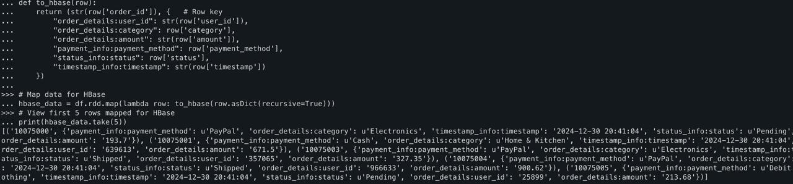

Hello,
---
We worked on **Analytics on real-time online ecommerce data** with large datasets with the help of bda, please follow these steps to run this project.

Files to download/clone:
- docker-compose.yml
- hbase_load.py
- hdfs_write.py
- kafka_producer.py
- tohbase.ipynb
- shc-core-1.1.1-2.4-s 2.11.jar

Download the dataset: https://www.kaggle.com/datasets/zainanis1/ecommerce-dataset

## **Steps:**
---
- 1:Run (up) the docker compose yml file to start the container
---
- 2:Then we need to ingest data so we use kafka,
- 2.1: Initialize kafka topics:

- ```bash
    kafka-topics --bootstrap-server localhost:9092 \
  --create --topic test-topic --partitions 1 --replication-factor 1


- 2.2:then run kafka producer: kafka_producer.py
- 2.3: Kafka consumer file to store raw data in hdfs: hdfs_write.py
---
- 3: Now use Spark to clean Data
  
---
- 4: Load Clean Data in HBASE by running hbase_load.py
---
- 5: Lastly run App.py to run flask web interface 
 


